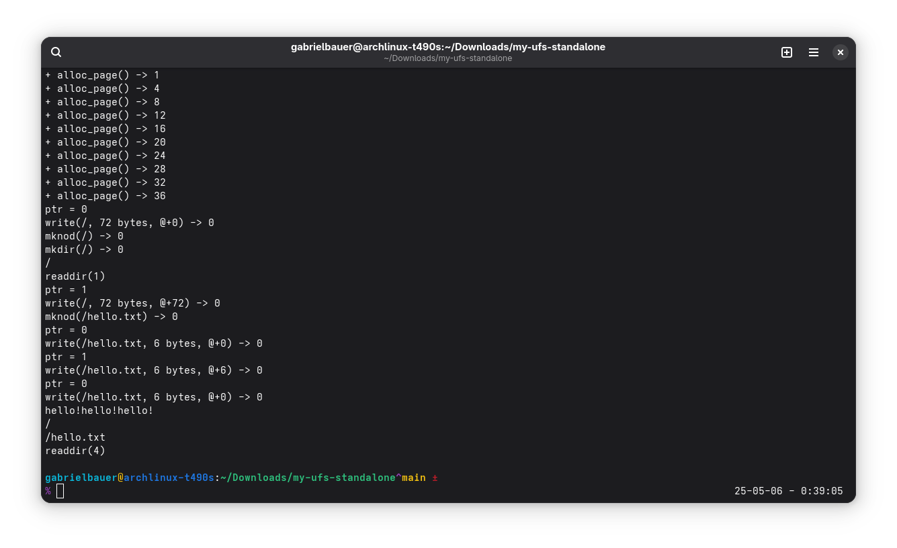

# My UFS Standalone

This repository contains code that I intended to write for the second project.

I wanted to implement a version of the Unix FileSystem that was closer to the actual
specifications of the filesystem.

I was able to get the code working perfectly as intended in my standalone code, but
not with FUSE. It kept freezing and would not unmount without rebooting.

Anyways, here is the beginnings of a reference implementation of UFS.

Things that need to be worked on:

	* It needs to be able to use single level directories
		- Partially complete, we can create a directory and reference it, but can't place files in them
	* After that, it needs to be able to support multi-level directories
	* It has no timestamps
	* It has no real permission model
	* Only one block (2MB) is pressumed, no superblocks
	* Hard links
 

Read More:

 [The UNIX Filesystem](https://www.dgp.toronto.edu/~kenxu/csc209/unixfilesystem-wk1.pdf)
